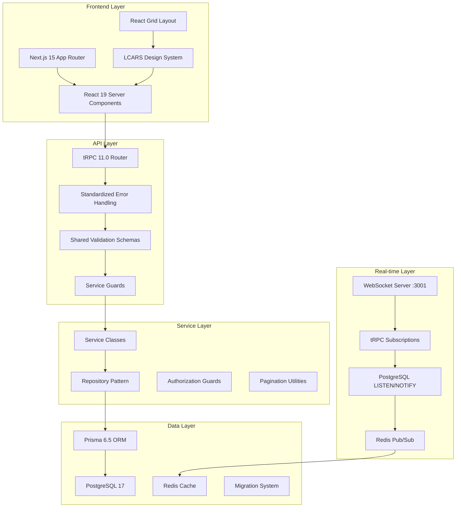
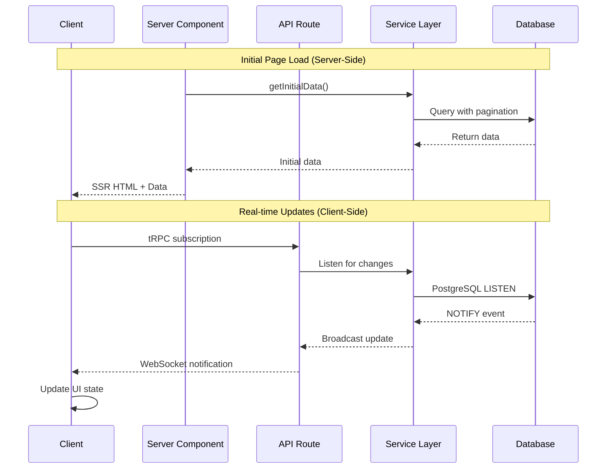

# 📚 READY ROOM DOCUMENTATION REVIEW & MAINTENANCE REQUEST

## 🎯 MISSION OVERVIEW

Ready Room is a production-ready Star Trek LCARS-themed collaboration platform with enterprise-grade architecture. We need a comprehensive documentation audit focused on maintenance, updates, and ensuring our documentation stays current with our rapidly evolving codebase.

## 🚀 CURRENT TECH STACK (2025-06-03)

### Frontend Architecture

- **Next.js 15.3.2 + React 19** - Server Components with use() hook, App Router, Suspense streaming
- **TypeScript 5.8.3** - Strict mode, zero 'any' policy, path mapping
- **LCARS Design System** - 25+ custom Star Trek UI components with full Storybook coverage needed
- **React Grid Layout 1.6.1** - Responsive widget dashboard with drag-and-drop
- **Tailwind CSS 3.4.20** - Custom coastal theme with LCARS color palette
- **Chart.js 4.5.1** - Dynamic imports for performance visualization

### Backend Architecture

- **tRPC 11.0.0** - Full-stack type safety with batch queries, subscriptions
- **Prisma 6.5.0 + PostgreSQL 17** - Migration-based schema, performance indexes
- **NextAuth.js v5** - Session management with Argon2id hashing, rate limiting
- **Redis 7+** - Pub/sub, caching, session storage
- **WebSocket Server** - Custom WSS implementation (port 3001) with authentication
- **Service Layer Pattern** - Repository interfaces, dependency injection, SOLID principles

### Recently Standardized Patterns (P1 Code Quality Improvements)

- **Error Handling**: `withErrorHandling` wrapper for all tRPC procedures
- **Pagination**: Shared `createPaginatedResponse` utilities
- **Authorization**: Service-level guards (`assertCanManageTeam`, `requireAdmin`)
- **Validation**: Shared Zod schemas from `~/lib/validations/common`
- **Component Modularity**: Large components refactored into focused subcomponents (<150 lines)
- **LCARS Toast System**: Browser alerts replaced with design-consistent notifications

## 📋 EXISTING DOCUMENTATION INVENTORY

### Root Documentation (Excellent Coverage)

- **README.md** - Project overview, setup instructions, architecture summary
- **PLAN.md** - Development roadmap with task tracking and priorities
- **CLAUDE.md** - AI development guidelines, commands, patterns, workflows
- **CHANGELOG.md** - Version history and feature updates
- **CONTRIBUTING.md** - Contribution guidelines and development workflow

### docs/ Directory (44 Files - Well Organized)

- **Architecture Decision Records (ADRs)**: 5 comprehensive documents
- **Feature Documentation**: Complete coverage of all major systems
- **Development Patterns**: Recently updated with standardized utilities
- **API Reference**: Complete tRPC endpoint documentation
- **Tutorials**: Step-by-step guides for common development tasks
- **Security & Performance**: Comprehensive guides for enterprise deployment

### Current Documentation Strengths

- ✅ **Architecture Foundation**: Strong ADR coverage with clear decisions
- ✅ **API Coverage**: 100% tRPC endpoint documentation
- ✅ **Feature Completeness**: All major features documented
- ✅ **Multi-audience Support**: Clear role-based navigation
- ✅ **Development Patterns**: Excellent standardized utilities guide

## 🔍 REVIEW OBJECTIVES (MAINTENANCE & UPDATE MODE)

### Primary Goals

1. **JSDoc Coverage Audit**: Analyze current ~22% coverage, prioritize improvements
2. **Storybook Story Review**: Ensure all 25+ LCARS components have comprehensive stories
3. **Documentation Synchronization**: Update docs to reflect recent P1 code quality improvements
4. **Component Documentation**: Focus on LCARS design system completeness
5. **Implementation Examples**: Add real-world usage patterns for new standardized utilities
6. **Mermaid Diagram Updates**: Refresh architectural diagrams with current patterns
7. **Developer Onboarding**: Ensure documentation supports efficient team member onboarding

### Specific Focus Areas

- **LCARS Component Documentation**: Currently only 1/25 components have JSDoc
- **Storybook Coverage**: Complete remaining 10 missing component stories
- **Hybrid Architecture Examples**: More implementation examples for Server Component + Client pattern
- **Standardized Utilities**: Document usage of new error handling, pagination, validation patterns
- **Widget Development**: Update widget creation guides with component modularity patterns

## 📊 CURRENT STATE ANALYSIS (BASELINE METRICS)

### JSDoc Coverage Assessment (~22% Overall)

```
CURRENT COVERAGE BY AREA:
✅ tRPC Routers: Excellent (89 JSDoc blocks across 21 files)
⚠️  Services Layer: Moderate (13/37 files have JSDoc)
⚠️  Utilities: Good (error handling, pagination well documented)
❌ LCARS Components: Critical Gap (1/25 components documented)
❌ React Components: Inconsistent coverage
❌ Hooks: Limited documentation
❌ Repository Layer: Missing standardized documentation
```

### Storybook Story Coverage (~51%)

```
CURRENT STORYBOOK STORIES:
✅ LCARS Design System: 14/25 components have stories
   ✅ Covered: Button, Card, Input, Badge, Dialog, Table, Alert, Avatar,
              Checkbox, Divider, Dropdown, Link, Switch
   ❌ Missing: Fieldset, Heading, Navbar, Select, Sidebar, Skeleton,
              Text, Textarea, Tooltip, Truncate (10 components)

✅ Widget System: 3 comprehensive widget showcases
✅ Other Components: 5 additional stories (notification badge, auth components)
```

### Documentation Quality Metrics

- **Total Documentation Files**: 44 (excellent coverage)
- **Architecture Documentation**: 80% complete (strong foundation)
- **Feature Documentation**: 100% complete (comprehensive)
- **API Documentation**: 100% complete (all tRPC endpoints)
- **Developer Guides**: 75% complete (good coverage)

## 🎯 DOCUMENTATION MAINTENANCE REQUIREMENTS

### 1. JSDoc Standards & Coverage Improvement

#### LCARS Component JSDoc Template

````typescript
/**
 * LCARS-themed [ComponentName] component for Starfleet interface consistency
 *
 * Provides authentic Star Trek LCARS styling with [specific functionality].
 * Supports [variants/features] and follows Federation design protocols.
 *
 * @component
 * @category LCARS Design System
 * @since 1.0.0
 *
 * @example Basic Usage
 * ```tsx
 * <LCARSComponent
 *   variant="primary"
 *   size="md"
 *   disabled={false}
 * >
 *   Content
 * </LCARSComponent>
 * ```
 *
 * @example With LCARS Styling
 * ```tsx
 * <LCARSComponent
 *   variant="amber"
 *   className="lcars-panel-gradient"
 * >
 *   Starfleet Operations Data
 * </LCARSComponent>
 * ```
 *
 * @param {Object} props - Component properties
 * @param {LCARSVariant} props.variant - LCARS color scheme (amber, blue, red, etc.)
 * @param {ComponentSize} props.size - Component size (sm, md, lg)
 * @param {boolean} [props.disabled=false] - Disables component interaction
 * @param {string} [props.className] - Additional CSS classes
 * @param {React.ReactNode} props.children - Component content
 *
 * @returns {React.ReactElement} Rendered LCARS component
 *
 * @accessibility
 * - ARIA labels provided for screen readers
 * - Keyboard navigation support
 * - High contrast LCARS colors meet WCAG standards
 *
 * @performance
 * - Memoized for optimal re-render performance
 * - CSS-in-JS optimized for bundle size
 */
````

#### tRPC Procedure JSDoc Template (Updated)

````typescript
/**
 * [Brief description of procedure functionality]
 *
 * [Detailed description including business logic, use cases, and integration points]
 *
 * @procedure [procedureName]
 * @router [routerName]
 * @authentication required|optional|none
 * @authorization [role requirements]
 * @rateLimit [if applicable]
 *
 * @param {Object} input - Procedure input parameters
 * @param {string} input.param1 - Description of parameter
 * @param {number} [input.param2=10] - Optional parameter with default
 *
 * @returns {Promise<ResultType>} Description of return value
 * @throws {TRPCError} UNAUTHORIZED - When user lacks permission
 * @throws {TRPCError} NOT_FOUND - When resource doesn't exist
 * @throws {TRPCError} BAD_REQUEST - When input validation fails
 *
 * @example Client Usage
 * ```typescript
 * const result = await api.router.procedure.query({ param1: 'value' });
 * ```
 *
 * @example With Error Handling
 * ```typescript
 * try {
 *   const result = await api.router.procedure.mutate(input);
 * } catch (error) {
 *   if (error.code === 'UNAUTHORIZED') {
 *     // Handle auth error
 *   }
 * }
 * ```
 *
 * @since 1.0.0
 * @see {@link relatedProcedure} for related functionality
 */
````

### 2. Storybook Story Requirements

#### Complete LCARS Component Stories Template

```typescript
import type { Meta, StoryObj } from '@storybook/react';
import { LCARSComponent } from './lcars-component';

const meta: Meta<typeof LCARSComponent> = {
  title: 'LCARS Design System/[CategoryName]/[ComponentName]',
  component: LCARSComponent,
  parameters: {
    layout: 'centered',
    docs: {
      description: {
        component: 'LCARS-themed component following Star Trek design protocols. Provides [functionality] with authentic Federation styling.',
      },
    },
  },
  tags: ['autodocs'],
  argTypes: {
    variant: {
      control: 'select',
      options: ['amber', 'blue', 'red', 'green'],
      description: 'LCARS color scheme variant',
    },
    size: {
      control: 'select',
      options: ['sm', 'md', 'lg'],
      description: 'Component size',
    },
    disabled: {
      control: 'boolean',
      description: 'Disables component interaction',
    },
  },
};

export default meta;
type Story = StoryObj<typeof meta>;

// Basic usage story
export const Default: Story = {
  args: {
    variant: 'amber',
    size: 'md',
    children: 'Starfleet Operations',
  },
};

// LCARS theme variations
export const LCARSVariants: Story = {
  args: {
    ...Default.args,
  },
  render: (args) => (
    <div className="space-y-4">
      <LCARSComponent {...args} variant="amber">Amber (Primary)</LCARSComponent>
      <LCARSComponent {...args} variant="blue">Blue (Secondary)</LCARSComponent>
      <LCARSComponent {...args} variant="red">Red (Alert)</LCARSComponent>
      <LCARSComponent {...args} variant="green">Green (Success)</LCARSComponent>
    </div>
  ),
};

// Size variations
export const Sizes: Story = {
  args: {
    ...Default.args,
  },
  render: (args) => (
    <div className="flex items-center gap-4">
      <LCARSComponent {...args} size="sm">Small</LCARSComponent>
      <LCARSComponent {...args} size="md">Medium</LCARSComponent>
      <LCARSComponent {...args} size="lg">Large</LCARSComponent>
    </div>
  ),
};

// Interactive states
export const States: Story = {
  args: {
    ...Default.args,
  },
  render: (args) => (
    <div className="space-y-4">
      <LCARSComponent {...args}>Normal State</LCARSComponent>
      <LCARSComponent {...args} disabled>Disabled State</LCARSComponent>
    </div>
  ),
};

// Real-world usage example
export const BridgeOfficerDashboard: Story = {
  args: {
    ...Default.args,
  },
  render: (args) => (
    <div className="bg-neutral-900 p-6 rounded-lg">
      <div className="grid grid-cols-2 gap-4">
        <LCARSComponent {...args} variant="amber" size="lg">
          System Status: Operational
        </LCARSComponent>
        <LCARSComponent {...args} variant="blue" size="lg">
          Warp Core: Stable
        </LCARSComponent>
      </div>
    </div>
  ),
};
```

### 3. Required Storybook Stories (Priority Order)

#### High Priority - Missing Core LCARS Components

1. **Navbar** - Bridge navigation component
2. **Sidebar** - Main navigation panel
3. **Heading** - Typography hierarchy
4. **Text** - Basic text styling
5. **Select** - Form dropdown component

#### Medium Priority - Form & Interaction Components

6. **Textarea** - Multi-line text input
7. **Tooltip** - Contextual help component
8. **Skeleton** - Loading states
9. **Fieldset** - Form grouping

#### Lower Priority - Utility Components

10. **Truncate** - Text overflow handling

### 4. Mermaid Diagram Updates Needed

#### System Architecture (Updated for Current Stack)



#### LCARS Component Architecture

```mermaid
graph TD
    subgraph "LCARS Design System"
        A[Base Components]
        B[Layout Components]
        C[Form Components]
        D[Data Display]
        E[Feedback Components]
    end

    subgraph "Base Components"
        A1[Button]
        A2[Badge]
        A3[Avatar]
        A4[Link]
    end

    subgraph "Layout Components"
        B1[Card]
        B2[Navbar]
        B3[Sidebar]
        B4[Divider]
    end

    subgraph "Form Components"
        C1[Input]
        C2[Select]
        C3[Checkbox]
        C4[Switch]
        C5[Textarea]
    end

    subgraph "Data Display"
        D1[Table]
        D2[Text]
        D3[Heading]
        D4[Truncate]
    end

    subgraph "Feedback Components"
        E1[Alert]
        E2[Dialog]
        E3[Tooltip]
        E4[Skeleton]
    end

    A --> A1
    A --> A2
    A --> A3
    A --> A4
    B --> B1
    B --> B2
    B --> B3
    B --> B4
    C --> C1
    C --> C2
    C --> C3
    C --> C4
    C --> C5
    D --> D1
    D --> D2
    D --> D3
    D --> D4
    E --> E1
    E --> E2
    E --> E3
    E --> E4
```



#### Hybrid Architecture Pattern



## 🏗️ DOCUMENTATION MAINTENANCE ROADMAP

### Phase 1: Foundation Improvements (Week 1-2)

**Priority: Critical Component Documentation**

- [ ] **LCARS Component JSDoc**: Add comprehensive documentation to all 25 components

  - [ ] Include prop interfaces with descriptions
  - [ ] Add usage examples with LCARS styling
  - [ ] Document accessibility features
  - [ ] Include performance notes

- [ ] **Complete Storybook Coverage**: Add stories for 10 missing components

  - [ ] Navbar (bridge navigation)
  - [ ] Sidebar (main navigation panel)
  - [ ] Heading (typography hierarchy)
  - [ ] Text (basic text styling)
  - [ ] Select (form dropdown)
  - [ ] Textarea (multi-line input)
  - [ ] Tooltip (contextual help)
  - [ ] Skeleton (loading states)
  - [ ] Fieldset (form grouping)
  - [ ] Truncate (text overflow)

- [ ] **Update Architecture Diagrams**: Refresh mermaid diagrams with current tech stack
  - [ ] System architecture with new standardized patterns
  - [ ] LCARS component hierarchy
  - [ ] Hybrid Server Component + Client pattern flow

### Phase 2: Implementation Examples (Week 3-4)

**Priority: Developer Experience Enhancement**

- [ ] **Standardized Utilities Documentation**: Add comprehensive examples

  - [ ] `withErrorHandling` usage patterns across different scenarios
  - [ ] `createPaginatedResponse` implementation examples
  - [ ] Service guard usage (`assertCanManageTeam`, `requireAdmin`)
  - [ ] Shared validation schema integration

- [ ] **Hybrid Architecture Examples**: Expand implementation guides

  - [ ] Server Component + Client Hybrid pattern examples
  - [ ] Real-time subscription patterns with toast notifications
  - [ ] Component modularity refactoring examples
  - [ ] State management with tRPC subscriptions

- [ ] **Widget Development Guide Updates**: Include component modularity patterns
  - [ ] Widget refactoring examples (large → focused subcomponents)
  - [ ] LCARS toast integration in widget actions
  - [ ] Performance optimization patterns

### Phase 3: Advanced Documentation (Week 5-6)

**Priority: Enterprise Readiness**

- [ ] **API Reference Generation**: Implement automated documentation

  - [ ] TypeDoc integration for automated API docs
  - [ ] OpenAPI spec generation for external integrations
  - [ ] Interactive API explorer with authentication

- [ ] **Performance Documentation**: Add optimization guides

  - [ ] Component performance patterns
  - [ ] Bundle optimization strategies
  - [ ] WebSocket subscription cleanup patterns
  - [ ] Database query optimization examples

- [ ] **Security Documentation**: Enterprise security patterns
  - [ ] Authentication flow documentation
  - [ ] Authorization pattern examples
  - [ ] Rate limiting implementation
  - [ ] Input validation patterns

### Phase 4: Innovation & Future (Week 7-8)

**Priority: Advanced Features & Maintenance**

- [ ] **Interactive Documentation**: Enhanced developer experience

  - [ ] Live code examples in documentation
  - [ ] Interactive component playground
  - [ ] API testing interface
  - [ ] Performance profiling tools

- [ ] **Accessibility Documentation**: LCARS-specific accessibility

  - [ ] Screen reader compatibility guides
  - [ ] Keyboard navigation patterns
  - [ ] Color contrast compliance
  - [ ] Star Trek theme accessibility considerations

- [ ] **Migration Guides**: Version upgrade documentation
  - [ ] Breaking change documentation
  - [ ] Automated migration scripts
  - [ ] Backward compatibility guides
  - [ ] Deprecation timelines

## 📊 SUCCESS METRICS & MAINTENANCE KPIs

### Documentation Quality Targets

- **JSDoc Coverage**: 80% for public APIs (current: ~22%)
- **Storybook Coverage**: 100% for LCARS components (current: ~51%)
- **API Documentation**: Maintain 100% coverage (current: 100%)
- **Component Documentation**: 100% of exported components have examples
- **Guide Completeness**: All critical development guides published

### Developer Experience Metrics

- **Onboarding Time**: Reduce new developer setup time by 50%
- **Component Discovery**: 90% of LCARS components easily discoverable
- **Implementation Speed**: Reduce common task completion time by 30%
- **Error Resolution**: Comprehensive troubleshooting coverage

### Maintenance Schedule

- **Weekly**: Update documentation for new features and API changes
- **Monthly**: Review and update Storybook stories for component changes
- **Quarterly**: Comprehensive JSDoc coverage audit and improvement
- **Annually**: Major documentation structure review and reorganization

## 🎯 DELIVERABLE REQUIREMENTS

**Save your complete analysis and recommendations to `documentation_report.md` including:**

### Required Report Sections

1. **Executive Summary**: Current state, gaps, and recommendations overview
2. **JSDoc Coverage Analysis**: Detailed file-by-file assessment with improvement priorities
3. **Storybook Story Audit**: Component coverage review with missing story identification
4. **Implementation Recommendations**: Specific action items with effort estimates
5. **Updated Mermaid Diagrams**: Refreshed architectural diagrams reflecting current patterns
6. **Maintenance Roadmap**: Phased approach with timelines and success metrics
7. **Documentation Standards**: Templates and guidelines for ongoing maintenance

### Report Format Requirements

- **Specific File References**: Include exact file paths and line numbers
- **Code Examples**: Provide concrete implementation examples
- **Priority Classification**: P0 (Critical), P1 (Important), P2 (Enhancement)
- **Effort Estimates**: Time requirements for each improvement
- **Success Criteria**: Measurable outcomes for each recommendation

### Maintenance Focus Areas

- **LCARS Design System**: Complete component documentation and story coverage
- **Standardized Patterns**: Document new error handling, pagination, validation utilities
- **Architecture Examples**: Real-world implementation patterns for hybrid architecture
- **Developer Onboarding**: Streamlined documentation for rapid team member integration

**Your analysis should prioritize maintenance and updates over new documentation creation, focusing on keeping our excellent documentation foundation current with our rapidly evolving enterprise-grade codebase.**
